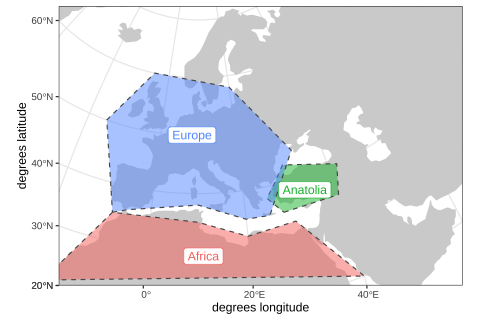
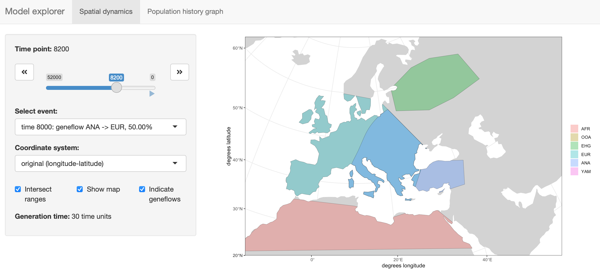
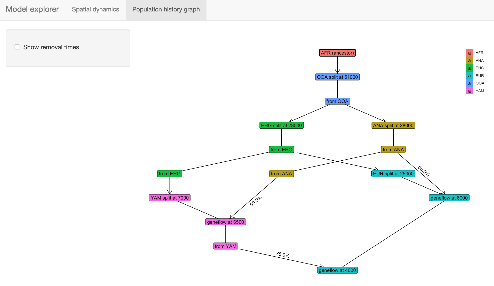
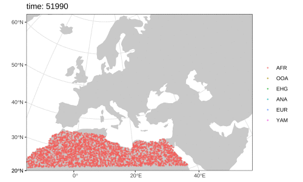

<!-- README.md is generated from README.Rmd. Edit that file instead. -->


## Spatiotemporal Population Genetics Simulations in R and SLiM

**This software is still under development!** <a href='https://bodkan.net/slendr'>
</a>
I have been making a good progress towards the first beta version, but
the package still has some way to go before being production ready. If you are interested, you can see the list of changes between versions [here](https://bodkan.net/slendr/news/index.html).

That said, if you would like to learn more, or if you're feeling brave
and would like to test the package yourself, take a look at the
[tutorial](https://bodkan.net/slendr/articles/slendr.html). Note that
getting it installed with all the geospatial dependencies can be a
little bit tricky at this point (see the relevant section in the
tutorial). If loading the package fails, check the error messages for
missing software and install it using the package manager of your choice
(on a Mac I recommend *homebrew*).

If you would like to stay updated with the developments:

1.  Click on the "Watch" button on the project's [Github
    website](https://www.github.com/bodkan/slendr).

2.  Follow me on [Twitter](https://www.twitter.com/fleventy5). I might
    post some updates once the software is a bit more ready.

### Installation

For installation instructions, please take a look at the installation
section [of the
tutorial](https://bodkan.net/slendr/articles/slendr.html#installation-and-setup-1).
Note that you might need to install some non-R software dependencies
first. At the very least, you will need the most recent version of the
[SLiM software](https://messerlab.org/slim/) (version 3.6 or later).

### Example

Here is a small demonstration of what *slendr* is designed to do. We want
to simulate spatiotemporal data representing the history of modern humans
in Eurasia after the Out of Africa migration. This example will be quite
brief, for more details, please see the
[tutorial](https://bodkan.net/slendr/articles/slendr.html) vignette.

The package is designed to allow the building of complex spatiotemporal
population genetics models in a single R script and then feeding such models
to SLiM using a template SLiM script.

#### 1. Setup the spatial context

First, we define the spatial context of the simulation. This will be the
entire "world" which will be occupied by populations in our model. Note
that in the world definition, we are explicitly stating which
projected [Coordinate Reference
System](https://en.wikipedia.org/wiki/Spatial_reference_system) (CRS)
will be used to represent landscape features, distances in kilometers,
etc.


```r
library(slendr)

map <- world(
  xrange = c(-15, 60), # min-max longitude
  yrange = c(20, 65),  # min-max latitude
  crs = "EPSG:3035"    # real projected CRS used internally
)
```

We can visualize the defined world map using the generic function `plot` provided
by the package.


```r
plot(map)
```


Although in this example we use a real Earth landscape, the `map` can be
completely abstract (either blank or with user-defined landscape features
such as continents, islands, corridors and barriers).

#### 2. Define broader geographic regions

In order to make building of population boundaries easier, we can define smaller
regions on the map using the function `region`.

Note all coordinates of are specified in the geographic coordinate system (degrees
longitude and latitude), but are internally represented in a projected CRS.
This makes it easier to define spatial features simply by reading the coordinates
from any regular map but makes simulations more accurate (distances and shapes
are not distorted because we can use a CRS tailored to the region of the world
we are working with).


```r
africa <- region(
  "Africa", map,
  polygon = list(c(-18, 20), c(40, 20), c(30, 33),
                 c(20, 32), c(10, 35), c(-8, 35))
)
europe <- region(
  "Europe", map,
  polygon = list(
    c(-8, 35), c(-5, 36), c(10, 38), c(20, 35), c(25, 35),
    c(33, 45), c(20, 58), c(-5, 60), c(-15, 50)
  )
)
anatolia <- region(
  "Anatolia", map,
  polygon = list(c(28, 35), c(40, 35), c(42, 40),
                 c(30, 43), c(27, 40), c(25, 38))
)
```

Again, we can use the generic `plot` function to visualize the objects:


```r
plot(africa, europe, anatolia)
```



#### 3. Define demographic history and population boundaries

The most important function in the package is `population`, which is used
to define names, split times, sizes and spatial ranges of populations.
Here, we specify times in years before the present, distances in kilometers.
If this makes more sense for your models, times can also be given in a forward
direction.

You will also note functions such as `move` or `expand` which are designed to
take a _slendr_ population object and change its spatial dynamics.

Note that in order to make this example executable on a normal local machine,
we deliberately decreased the sizes of all populations.


```r
afr <- population( # African ancestral population
  "AFR", parent = "ancestor", time = 52000, N = 3000,
  map = map, polygon = africa
)

ooa <- population( # population of the first migrants out of Africa
  "OOA", parent = afr, time = 51000, N = 500, remove = 25000,
  center = c(33, 30), radius = 400e3
) %>%
  move(
    trajectory = list(c(40, 30), c(50, 30), c(60, 40)),
    start = 50000, end = 40000, snapshots = 20
  )

ehg <- population( # Eastern hunter-gatherers
  "EHG", parent = ooa, time = 28000, N = 1000, remove = 6000,
  polygon = list(
    c(26, 55), c(38, 53), c(48, 53), c(60, 53),
    c(60, 60), c(48, 63), c(38, 63), c(26, 60))
)

eur <- population( # European population
  name = "EUR", parent = ehg, time = 25000, N = 2000,
  polygon = europe
)

ana <- population( # Anatolian farmers
  name = "ANA", time = 28000, N = 3000, parent = ooa, remove = 4000,
  center = c(34, 38), radius = 500e3, polygon = anatolia
) %>%
  expand( # expand the range by 2.500 km
    by = 2500e3, start = 10000, end = 7000,
    polygon = join(europe, anatolia), snapshots = 20
  )

yam <- population( # Yamnaya steppe population
  name = "YAM", time = 7000, N = 500, parent = ehg, remove = 2500,
  polygon = list(c(26, 50), c(38, 49), c(48, 50),
                 c(48, 56), c(38, 59), c(26, 56))
) %>%
  move(trajectory = list(c(15, 50)), start = 5000, end = 3000, snapshots = 10)
```

We can use the function `plot` again, but we get a warning informing us that
plotting complex model dynamics over time on a single map is not a good idea.
Below, we show a better way to do this using a built-in interactive R shiny
app.


```r
plot(afr, ooa, ehg, eur, ana, yam)
```


#### 4. Define geneflow events

By default, overlapping populations in SLiM do not mix. In order to schedule
an geneflow event between two populations, we can use the function `geneflow`.
If we want to specify multiple such events at once, we can collect them in a
simple R list:


```r
gf <- list(
  geneflow(from = ana, to = yam, rate = 0.5, start = 6500, end = 6400, overlap = FALSE),
  geneflow(from = ana, to = eur, rate = 0.5, start = 8000, end = 6000),
  geneflow(from = yam, to = eur, rate = 0.75, start = 4000, end = 3000)
)
```

#### 5. Compile the model to a set of configuration files


```r
model <- compile(
  populations = list(afr, ooa, ehg, eur, ana, yam), # populations defined above
  geneflow = gf, # geneflow events defined above
  generation_time = 30,
  resolution = 10e3, # resolution in meters per pixel
  competition_dist = 130e3, mate_dist = 100e3, # spatial interaction in SLiM
  dispersal_dist = 70e3, # how far will offspring end up from their parents
  dir = file.path(tempdir(), "readme-model"), overwrite = TRUE
)
```

Compiled model is kept as an R object which can be passed to different
functions, most importantly the `slim()` function shown below. Evaluating
it in the console prints its brief summary:


```r
model
#> slendr 'model' object 
#> --------------------- 
#> populations: AFR, OOA, EHG, ANA, EUR, YAM 
#> geneflow events: [no geneflow]
#> generation time: 30 
#> time direction: backward 
#> model type: spatial
#>   - number of spatial maps: 60 
#>   - resolution: 10000 distance units per pixel
#> 
#> configuration files in: /private/var/folders/hr/_t1b0f5n7c76yrfsg8yk9l100000gn/T/RtmpJWFvyA/readme-model 
#> 
#> A detailed model specification can be found in `$splits`, `$geneflows`,
#> `$maps`, `$populations`, and other components of the model object (for
#> a complete list see `names(<model object>)`). You can also examine
#> the serialized configuration files in the model directory.
```

#### 6. Visualize the model

The package provides an [R shiny](https://shiny.rstudio.com)-based browser app `explore()` for
checking the model dynamics interactively and visually. For more complex models,
this is much better than static spatial plots such as the one we showed in step
2 above:


```r
explore(model)
```

The function has two modes:

a) Plotting spatial map dynamics:



b) Displaying the demographic history graph (splits and geneflow events) embedded in the specified model:



#### 7. Run the model in SLiM

Finally, we can execute the compiled model in SLiM. Here we run the simulation
in a batch mode, but we could also run it in SLiMgui by setting `method = "gui"`.

The `slim` function generates a complete SLiM script tailored to run the
spatial model we defined above. This saves you, the user, a tremendous amount
of time.


```r
slim(
  model,
  seq_length = 1, recomb_rate = 0, # simulate only a single locus
  save_locations = TRUE, # save the location of everyone who ever lived
  method = "batch", # change to "gui" to execute the model in SLiMgui
  seed = 314159265
)
```

As specified, the SLiM run will save ancestry proportions in each
population over time as well as the location of every individual who
ever lived.

#### 8. Re-capitulate the SLiM run as an individual-based animation

We can use the saved locations of every individual that lived throughout the
course of the simulation to generate a simple GIF animation:


```r
animate(model, steps = 100, width = 500, height = 300)
```



Note that it is possible to simulate population splits and geneflows
both by "physically" moving individuals of a population from one
destination to the next across space but it is also possible to do this
more abstractly (in instantaneous "jumps") in situations where this is
more appropriate or where simulating accurate movement is not necessary.

In this case, the only population movement we explicitly encoded was
the split and migration of the OOA population from Africans and the
expansion of Anatolians. All the other populations simply popped up on
a map, without explicitly migrating there. Similarly, the geneflow
from Anatolians into the Yamnaya specified in step 4. did not require
a spatial overlap between the two populations, but the other two geneflow
events did.
